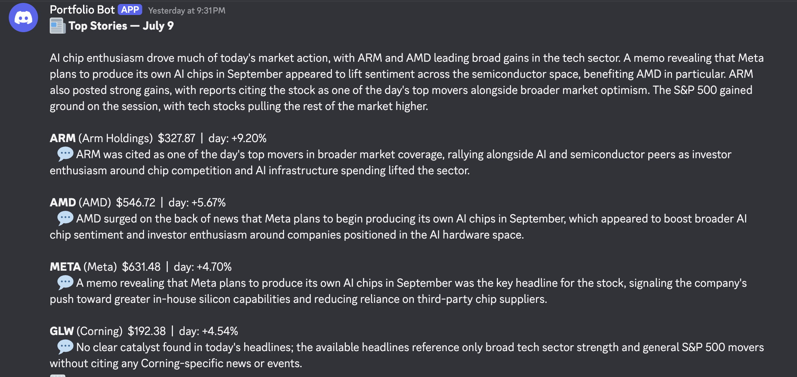
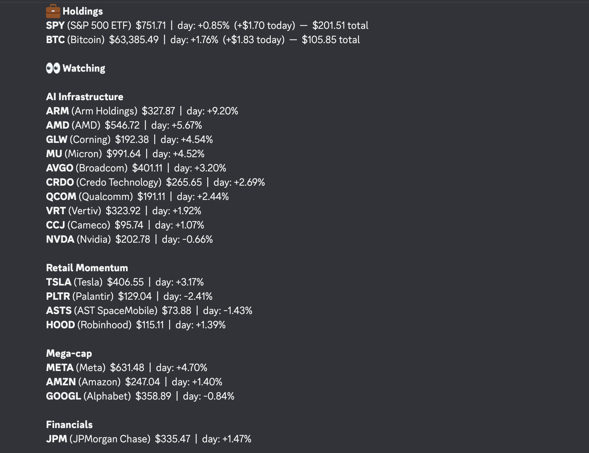

# Daily Portfolio Digest — AI-Enriched Market Briefing Pipeline

A self-hosted automation that delivers two formatted Discord messages every day: a **narrative "Top Stories" briefing** explaining why the day's biggest movers actually moved, and a **full portfolio digest** covering holdings, a 25-ticker watchlist organized by theme, dollar-impact tracking, and 52-week range context.

Zero manual steps. Zero subscription cost. Built with n8n, JavaScript, the Finnhub API, and the Anthropic API.

[Automation canvas](canvas.png)

## The Problem

I was checking scattered positions across apps with no consolidated view, and even when I did check, a raw percentage like "CRDO -5.9%" told me nothing about *why* — was that a real story, or just noise? I wanted one automated daily brief that showed how my holdings and a themed watchlist moved, explained the standout stories in plain language grounded in real headlines, and delivered all of it to my phone with no manual effort.

## What It Does

Every day at market close, the workflow:

1. Pulls live quotes for 25 tickers (stocks + crypto) from Finnhub
2. Computes day-over-day change against **its own self-maintained price history** — no paid historical-data API needed
3. Pulls 52-week high/low data and flags any ticker within 10% of either extreme
4. Identifies the day's biggest movers (±3% or more) and fetches recent headlines for each
5. Sends those headlines to Claude, which writes a short narrative explaining *why* each mover likely moved — grounded strictly in the provided headlines, with explicit instructions to say "no clear catalyst found" rather than fabricate a reason
6. Formats everything into two Discord messages — a Top Stories briefing and the full numeric digest — sorted so the most notable information surfaces first
7. Saves today's prices as a dated snapshot for tomorrow's comparison

## What It Looks Like

**Top Stories** — the AI-generated narrative, grounded in real headlines:



**Daily Portfolio Digest** — holdings with dollar impact, watchlist grouped by theme:



## Architecture

```
Schedule Trigger (daily, market close)
        │
   Ticker List ──────────── 25 items, one per symbol
        │
   ┌────┴────────────────────────┐
   │                              │
Finnhub Quotes              Finnhub 52wk Metrics
   │                              │
   └──────────┬───────────────────┘
              │
     Consolidate (price + 52wk data, matched by symbol)
              │
     Compare ──────── read/write dated snapshots on disk,
              │        compute day-over-day change
              │
   ┌──────────┴──────────────────┐
   │                               │
Flag Top 4 Movers            (price data passes through)
   │
Fetch News (per ticker)
   │
Trim to Top 2 Headlines/Ticker
   │
Build Claude Prompt
   │
Call Claude API
   │
Parse Response
   │
   └──────────┬───────────────────┘
              │
        Merge (sync gate — waits for both branches)
              │
        Format Digest ──── build both messages
              │
        Discord Webhook ── send Top Stories, then Portfolio Digest
```

In one sentence: **a small ETL pipeline with an AI enrichment layer** — extract from market and news APIs, transform against persisted state, synthesize with an LLM under strict grounding rules, load to a messaging channel.

## Design Decisions Worth Explaining

**Self-maintained price history.** The pipeline persists a dated JSON snapshot to local disk on every run and computes day-over-day change against its own memory, with lookback tolerance for weekends and missed runs — no paid historical-data API required.

**Grounded AI narrative, not generated confidence.** The Claude prompt explicitly instructs: only state a reason if it's directly supported by the provided headlines, and say so honestly if nothing relevant is found rather than guessing. This matters — an LLM asked "why did this move" without that guardrail will produce a plausible-sounding fabrication. Several tickers in the example above ended up explicitly showing "no clear catalyst found" rather than an invented story, which was the intended behavior, not a failure.

**Cost-aware AI usage.** Rather than calling Claude once per ticker (expensive, noisy), the pipeline batches the day's top 4 movers into a single prompt and makes one API call per run, parsing a structured JSON response back into per-ticker explanations plus one synthesized opening paragraph.

**Two-message architecture to respect platform limits.** Discord caps messages at 2000 characters. Rather than truncating content, the digest is split into two purpose-built messages — a narrative-first "Top Stories" briefing and a complete numeric digest — so nothing gets cut and each message stays focused on one kind of information.

**Conditional, not constant, 52-week context.** Early versions showed 52-week data on every line regardless of relevance, which was noisy and blew past message limits. The current version stays silent unless a ticker is genuinely within 10% of its high or low — and Holdings (only 3 positions) get a fuller treatment with a visual range gauge, since there's room to spare there that the 25-ticker watchlist doesn't have.

**Sector-tagged watchlist with reasoned selections.** Each of the 25 tracked tickers was chosen for a specific reason — AI-infrastructure suppliers alongside the mega-caps that fund that spending, a name mid-parabolic-reversal as a volatility case study, an earnings-season bank stock, an energy name that moves on a completely different axis than the rest of the list (geopolitics, not AI sentiment) — rather than just "popular stocks." The watchlist is grouped and sorted by sector and magnitude of move, so correlated stories (e.g., three AI-infrastructure names dropping together) are visible as a pattern, not scattered across an alphabetical list.

## What Broke and How I Fixed It

- **Safari secure-cookie block, file-access restrictions, sandboxed `fs` module** — resolved with environment flags (`N8N_SECURE_COOKIE`, `N8N_RESTRICT_FILE_ACCESS_TO`, `NODE_FUNCTION_ALLOW_BUILTIN`), now baked into a single launch script.
- **Silent snapshot corruption.** The memory file was once overwritten with formatted message text instead of price data because the file-write step sat downstream of formatting. Diagnosed by reading item counts on the canvas — a branch showed "1 item" where price data should have shown far more. Fixed by moving persistence logic upstream of formatting entirely.
- **Timezone bug in the date logic.** Using `toISOString()` for "today's date" silently rolled over to the next calendar day after ~8pm Eastern (UTC-based), corrupting the day-over-day comparison. Fixed by computing the date from local year/month/day components instead of UTC.
- **Double-execution from parallel branches.** When both the price-data branch and the AI-narrative branch connected directly into the formatting node, n8n ran that node once per incoming connection — silently doubling every Discord message. Fixed with a Merge node acting purely as a synchronization gate, forcing the formatter to wait for both branches before running exactly once.
- **JSON body corruption from unescaped headlines.** Raw news headlines occasionally contained characters that broke hand-built JSON strings sent to the Claude API. Fixed by using `JSON.stringify()` to build the request body programmatically instead of string-templating it, letting the correct escaping happen automatically.
- **Discord's 2000-character message limit.** Solved by restructuring into two purpose-built messages rather than trimming content people actually wanted to read.

## Stack

| Piece | Choice | Why |
|---|---|---|
| Orchestration | n8n (self-hosted, local) | Free, visual debugging, per-item execution model |
| Market data | Finnhub free tier | Quotes, 52-week metrics, company news — one key, one provider |
| AI synthesis | Anthropic API (Claude) | Structured JSON output, strong instruction-following for grounding rules |
| Persistence | Dated JSON files on disk | Free historical data via self-maintained state |
| Delivery | Discord webhook | No auth, no OAuth, instant mobile push |
| Logic | JavaScript (n8n Code nodes) | Comparison math, formatting, API orchestration |

## Running It

1. Import `workflow.json` into n8n
2. Get a free API key at [finnhub.io](https://finnhub.io) and an API key at [console.anthropic.com](https://console.anthropic.com), add both to the relevant HTTP Request nodes
3. Create a Discord webhook (Server Settings → Integrations → Webhooks) and paste the URL into the Discord node
4. Create a snapshot directory and launch n8n with:

```bash
N8N_SECURE_COOKIE=false \
N8N_RESTRICT_FILE_ACCESS_TO=/path/to/snapshot/dir \
NODE_FUNCTION_ALLOW_BUILTIN=fs \
npx n8n
```

5. Edit the ticker array and `SHARES`/`HOLDINGS` objects in the relevant Code nodes to match your own positions and watchlist
6. Publish the workflow and set it Active

## Roadmap

- **Concentration alerts** — flag when a single position drifts past a set share of tracked value
- **Earnings calendar warnings** — surface upcoming report dates so nothing blindsides me
- **Risk monitoring layer** — rolling volatility flags, drawdown-from-high tracking, correlation risk across the AI-infrastructure cluster
- **Always-on hosting** — currently runs while my Mac is awake or asleep-with-Power-Nap; migration to a small cloud instance or Raspberry Pi would remove that dependency entirely

---

*Built July 2026. Not investment advice — this tool reports what happened and, where the evidence supports it, why. The thinking is still my job.*
